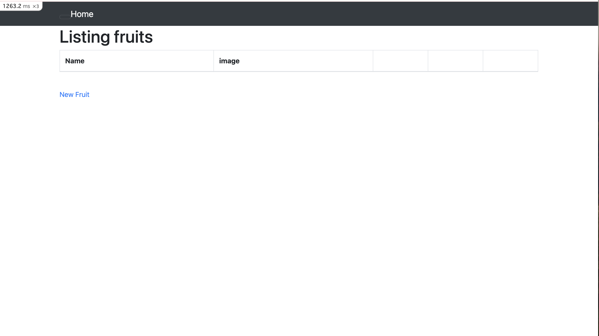
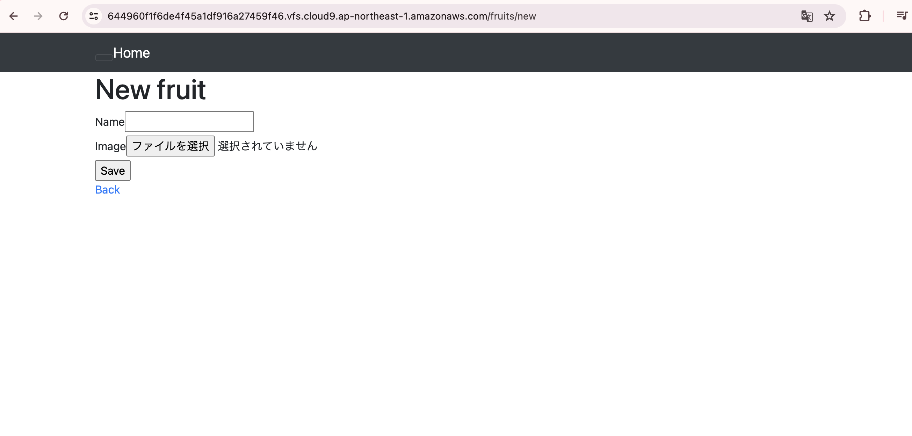
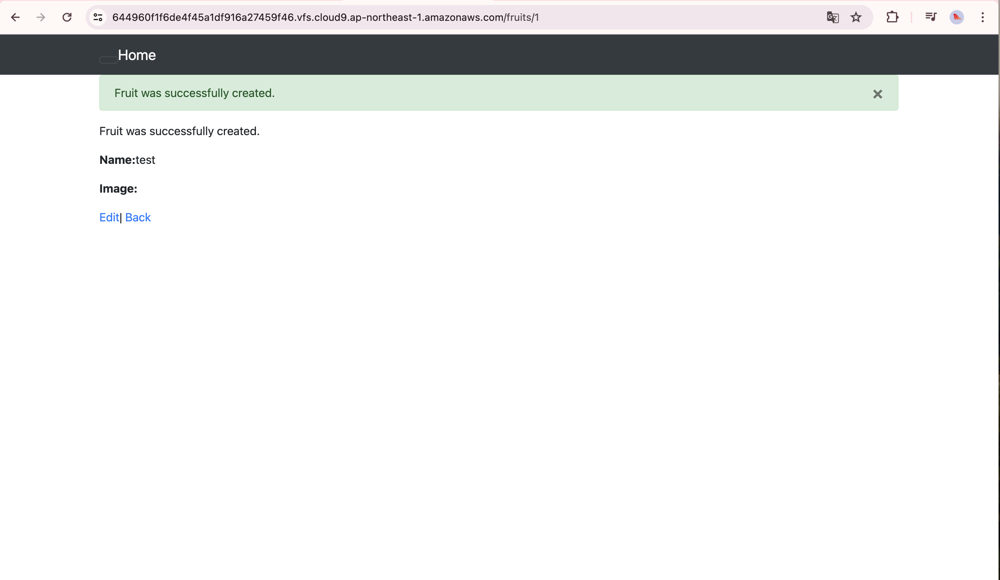
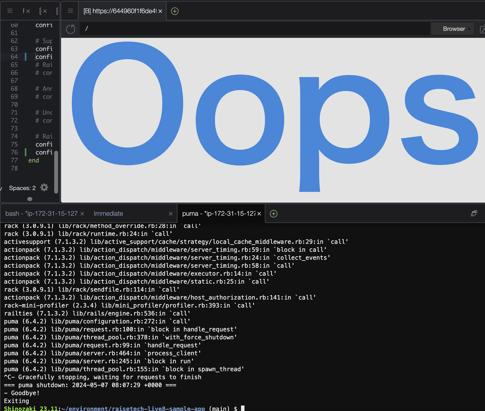
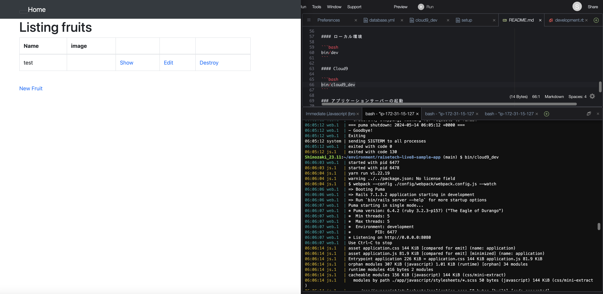
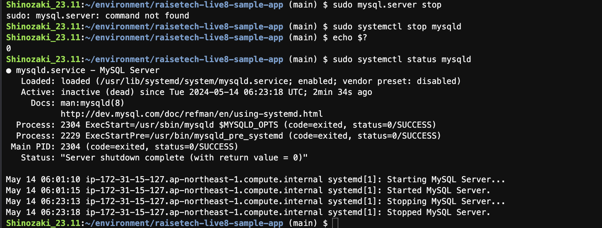
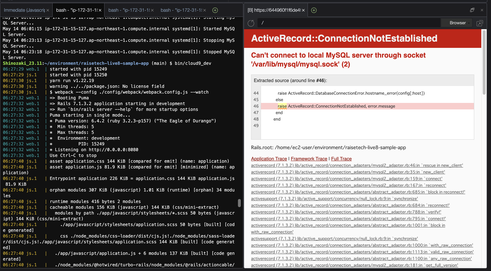

## 第3回課題内容

   
   
 

#### AP サーバー
* Puma バージョン: 6.4.2  
   
 

#### DB サーバー  
* MySQL バージョン: 8.4.0 
 
 
* Rails の構成管理ツール名：Bundler

## 感想
* 今回の課題は理解が及ばず、講義を再視聴・用語検索等していたため行動に移すまでに時間がかかった
* 早々にt3.microに変更しておけば、時間を無駄にすることなく進められたのにと少し後悔した
* 以下の機能があると勉強の効率がよく、時間短縮になると思った   
1.Zoomに再生を遅くする機能  
2.講義の内容（PDF資料の目次）ごとに、Youtubeが追加した「ディープリンク」のような機能
